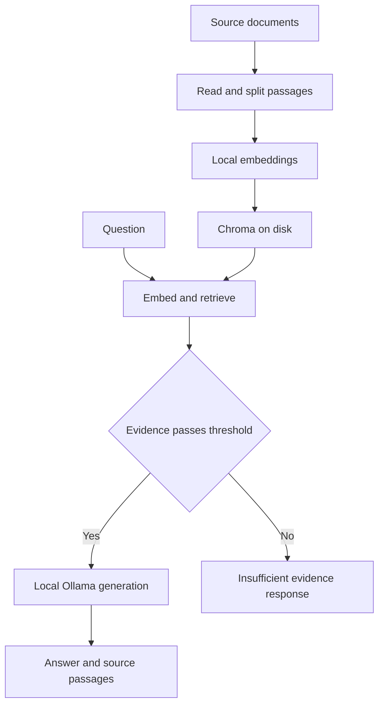

# Technology choices and alternatives

## Purpose and decision

Build a beginner Data Governance RAG Assistant that runs on an existing computer without paid APIs or cloud services. The domain connects to data stewardship: ownership, quality rules, issue remediation, and access approvals. Samples are fictional, not official DFS procedures. This document records design judgments for this small project rather than declaring one technology universally best.

The repository already contained a LangChain ingestion draft with an `OpenAIEmbeddings` import. Version 1 replaces that potential paid dependency with Sentence Transformers, completes the retrieval and generation pipeline, and preserves the original company sample documents.

## Comparison

| Selected component | Why it fits this project | Alternatives considered | Main tradeoff and when to reconsider |
|---|---|---|---|
| Python | One language for ingestion, vector search, evaluation, and UI | JavaScript or TypeScript | TypeScript fits custom web products; Python makes this first learning pipeline easier to inspect. |
| Streamlit | Build an interactive interface with little frontend code | Gradio; React with FastAPI | Gradio is suitable for model demos. React provides more UI control but adds a separate frontend and deployment work. |
| pypdf | Extract text from PDFs while retaining physical page references | pdfplumber; OCR tools | pdfplumber is worth testing for complex layouts. pypdf does not solve scanned documents; OCR adds another pipeline. |
| Sentence Transformers with all-MiniLM-L6-v2 | Local semantic embeddings using a compact English model | Ollama embedding models; hosted embedding APIs | Requires PyTorch and a model download. Ollama embeddings could consolidate runtimes. Hosted embeddings introduce external service dependence. MiniLM truncates long text, so passages are deliberately small. |
| Chroma persistent local client | Stores vectors, text, and metadata on disk with a Python interface | FAISS; Qdrant local | FAISS offers efficient vector search but requires surrounding metadata and persistence logic. Qdrant is worth revisiting for a service based deployment. |
| Ollama with qwen2.5:1.5b | Scriptable local generation with a small starter model | llama.cpp; LM Studio; hosted LLM APIs | llama.cpp gives lower level control; LM Studio offers a desktop workflow. Small models can produce weak or unsupported answers; test larger local models only if existing hardware permits. |
| Plain Python pipeline | Each RAG stage is visible and the first version needs no orchestration framework | LangChain; LlamaIndex | This changes the initial proposal. Frameworks become useful for more connectors, structured pipelines, or advanced retrieval; they add APIs and dependencies to learn. |
| Git and GitHub | Version history and portfolio presentation in the requested repository | GitLab; local Git | No paid GitHub features are needed. Local inference cannot be made public simply by publishing the repository. |
| Standard library unittest | Test key behavior without another testing package | pytest | pytest offers useful fixtures as the suite grows; unittest is enough for the initial tests. |

## Architecture

Retrieval adds relevant passages to a prompt at question time. It does not train the language model on the corpus. A retrieved source is evidence to inspect, not proof that every generated claim is correct.

## No paid service dependency

- Use downloaded models, local Chroma, and a local Streamlit server.
- No paid API SDK or paid credential is included.
- Generation URL is fixed to loopback; cloud model tags are rejected; proxy and redirect forwarding are disabled.
- Start Ollama with `OLLAMA_NO_CLOUD=1` and restart an existing server before applying it. Local API means communication between programs on the same computer; it does not mean a metered online API.
- Do not add cloud hosting, remote inference, billing accounts, or paid plugins to this version.
- Downloads, disk space, memory, electricity, and internet still consume existing resources. Software without service charges does not guarantee that any computer can run every model.

The default Qwen 2.5 1.5B model and MiniLM embedding model list Apache 2.0 licensing on their model pages. Other model sizes may use different licenses. Review the selected model's page when changing models.

## Dependencies and constraints

Use a virtual environment and `requirements.txt`. No Docker or additional plugin is needed. CPU embeddings are configured explicitly. The starter model is configurable because the owner's RAM and processor have not been confirmed. Pinning direct dependencies records the tested environment once installation succeeds; it does not create a complete transitive lock file.

Character windows of 600 characters with 100 character overlap make chunk behavior easy to learn and usually keep passages short. They can split sentences and do not strictly enforce token limits. More advanced splitting is a future experiment. PDF extraction can miss layout or tables; empty text cannot be indexed. Index rebuild replaces stale content and must be run after document edits.

## Evaluation and future decisions

The small labeled evaluation set checks expected source retrieval and rejection of absent questions. It is a smoke evaluation, not a benchmark. Compare top-k or chunk size settings, manually review generated evidence support, and report observed latency with hardware details. Similarity is not calibrated confidence; the default threshold needs tuning.

MCP is deferred until the RAG pipeline has been run successfully. A later local MCP server could expose `search_documents` using the same retrieval code. MCP connects clients to tools; it does not replace retrieval or provide a model for free.

## Official sources

- [Streamlit documentation](https://docs.streamlit.io/)
- [pypdf documentation](https://pypdf.readthedocs.io/en/stable/)
- [Sentence Transformers documentation](https://sbert.net/)
- [MiniLM model card](https://huggingface.co/sentence-transformers/all-MiniLM-L6-v2)
- [Chroma getting started](https://docs.trychroma.com/docs/overview/getting-started)
- [Ollama local operation and cloud controls](https://docs.ollama.com/faq)
- [Qwen 2.5 1.5B model details and license](https://ollama.com/library/qwen2.5:1.5b)
- [LangChain RAG learning examples](https://github.com/langchain-ai/rag-from-scratch)
- [LlamaIndex](https://github.com/run-llama/llama_index)

Reviewed 5 October 2026. Selection rationale is specific to this educational project. Update this document when implementation choices change.
